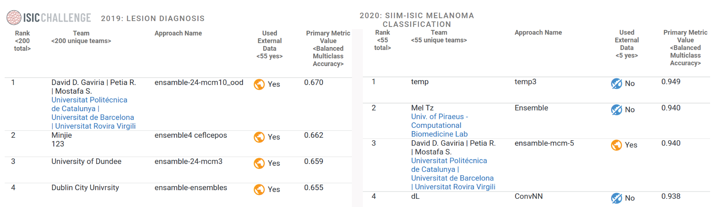

# SIIM-ISIC-Melanoma-Classification

Repository for a proposed solution for the SIIM-ISIC Melanoma 2019 and 2020 classification problem. 

Paper with the details can be found [here](./resources/archive.pdf)

This study has reached top 1 in 2019 ISIC [live leaderboard](https://challenge.isic-archive.com/leaderboards/live/) and top 3 in 2020 with 0.670 and AUC of 0.940 respectively.

The field of Computer Vision has for years been dominated by Convolutional Neural Networks in the medical field. However, there are various other deep learning techniques that have become very popular in this space. Vision Transformers (ViTs) are an example of a deep learning technique that has been gaining in popularity in recent years. In this work, we study the performance of ViTs and CNNs on skin lesions classification tasks. We compare the performance of Vision Transformers to that of Convolutional Neural Networks and show that regardless of the performance of both architectures, an ensemble of both can improve generalization. We also present an extension to the Gram-OOD method for out-of-distribution samples on medical skin lesion images and an extension to the model . Finally, we train an ensemble of ViTs and CNNs and compare it to single networks, demonstrating that performance is enhanced by reaching first place on the 2019 ISIC Challenge Live Leaderboard.
